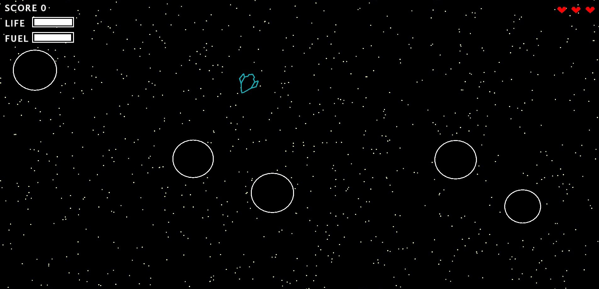
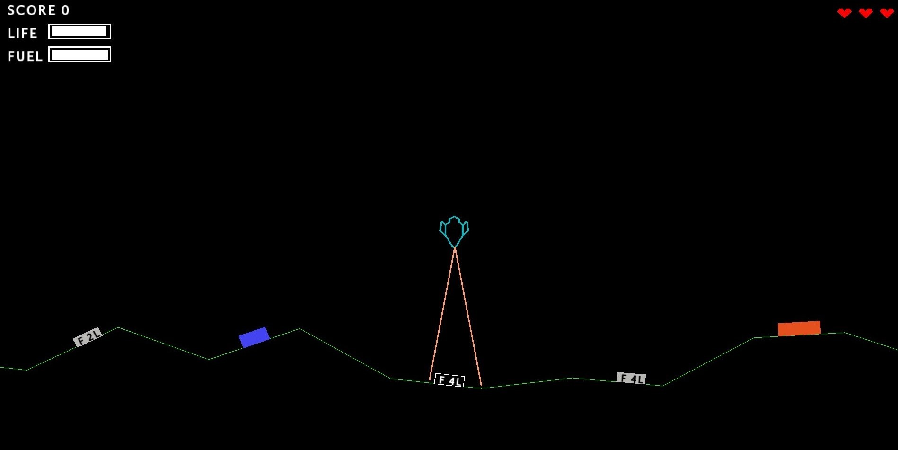

# No-Gravitar

---

### Table of Contents

- [Description](#description)
- [Gameplay](#gameplay)
- [References](#references)
- [License](#license)
- [Author Info](#author-info)

---

## Description

No Gravitar is a spaceship game for PC. The main difference with *Gravitar (Atari, 1982)* is that in this one ther is no gravity at all. 
The player controls a little spaceship and moves with it through different solar systems and planets. On each planet, there are multiple bunkers: in order to conquer the planet the user has to destroy them all. Once all the planets are destroyed, the solar system is conquered and the game moves to the next one.
The player must be careful to not get himself shot and to not run out of fuel.   

## Gameplay

The player can use left and right arrow to rotate, while up and down arrow allow the user to move in the chosen direction. Up arrow also allows to speed up. 
To land on a planet is sufficient to pass over it with the spacecraft. Space bar is for shoting while tab key is to activate tractor beam that allows you to collect fuel.

[Back To The Top](#No-Gravitar)

---

## How To Use

## Installation

## Author Info

This project has been carried out by: *Sofia Gavanelli*, *Erika Lena*, *Martina Ritrovato*.

Contact details:
    -  sofiagavanelli@gmail.com
    -  erika.lena@gmail.com
    -  martiross99@gmail.com

[Back To The Top](#No-Gravitar)
